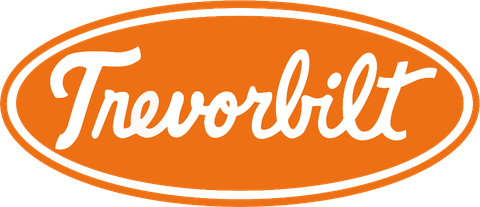
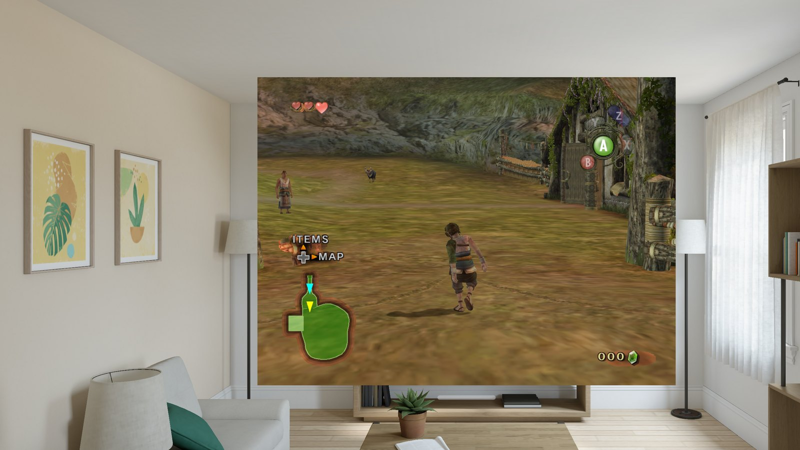
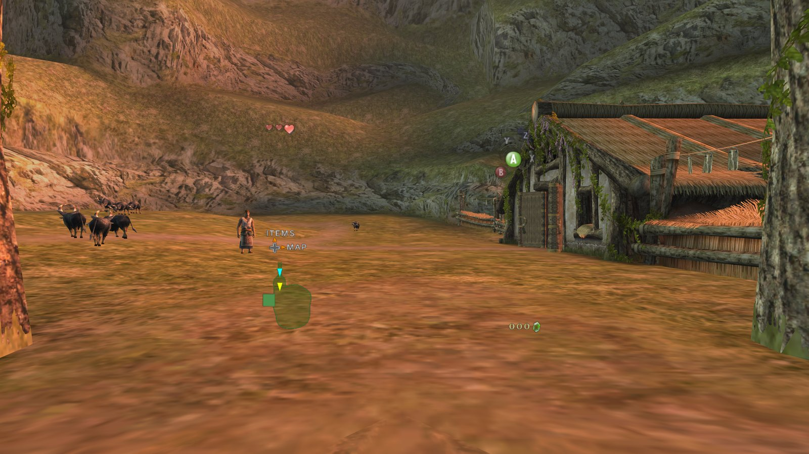
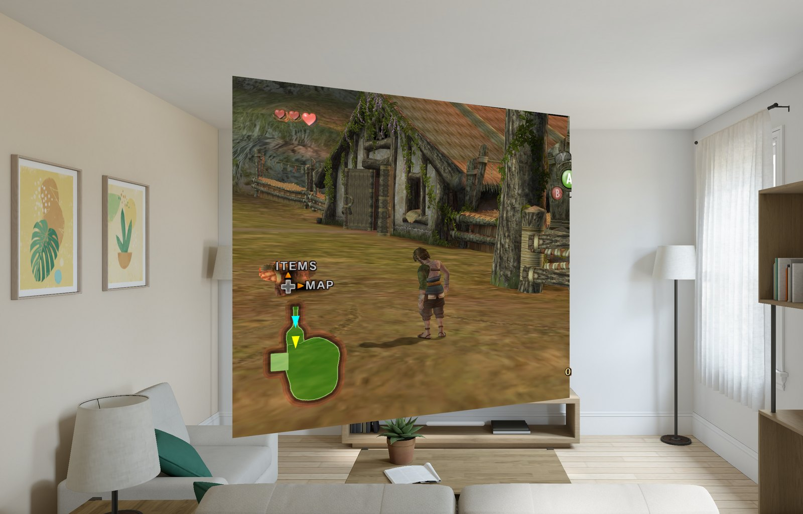

<p align="center">
  <a href="https://trevorbilt.com"></a>
</p>

<h1 align="center">Twilight Princess VR for Apple Vision Pro</h1>

<p align="center"><b>Hyrule, all around you.</b></p>

<div align="center">

[](https://github.com/edgytoast/avp-ports-index/blob/main/ports/twilight-princess-vr.md)

</div>

<p align="center">
  
  <br><sub>The Window view at Ordon Ranch, in the visionOS Simulator's living room.</sub>
</p>

*The Legend of Zelda: Twilight Princess* (2006) running natively on Apple Vision Pro, in six
degrees of freedom. Swing Link's sword with your own arm, raise the shield, draw the bow, or hang
Hyrule on your wall as a window you can lean into. No PC, no streaming: just the headset.

Twilight Princess VR is [Trevorbilt](https://trevorbilt.com)'s native visionOS port, built on
JoeyAW's [TPVR](https://github.com/JoeyAW/TPVR) mod for [Dusklight](https://twilitrealm.dev/): you
bring the game, you build the app, Hyrule does the rest. It's listed in the
[AVP Ports Index](https://github.com/edgytoast/avp-ports-index/blob/main/ports/twilight-princess-vr.md).

> [!IMPORTANT]
> There are no game files and no app download here. You need your own Twilight Princess disc
> (GameCube or Wii) and a Mac to build with. Twilight Princess VR is a fan project. It isn't
> affiliated with or endorsed by Nintendo.

## What you get

- **Three ways to play**, picked in the launcher:
  - **Full**: Hyrule all around you, in first person and at life scale. Menus, loading screens and
    fades to black can float in your room instead of a black void.
  - **Progressive**: a portal into Hyrule that the Digital Crown widens and narrows.
  - **Window**: the GameCube game in third person, in a window beside your other apps. The game's
    own 3D scene is rebuilt behind the glass every frame and rendered from wherever your eyes
    actually are, so you can lean in and look around. The HUD sits on the glass, and the game's
    bloom, mist and fades are laid over the scene.
- **Your hands are Link's hands.** PS VR2 Sense controllers put the sword and shield where yours
  are. No controller? In Full and Progressive, play with your bare hands. A DualSense, Xbox or
  other gamepad works too.
- **Sharper than a GameCube ever was.** SMAA or FXAA anti-aliasing, and render resolution up to
  150%.
- **Polite to your living room.** The game pauses when you take the headset off, and if you wander
  too far from where you started, Hyrule fades into your room before you meet the coffee table.

<p align="center">
  
  <br><sub>Full immersion at Ordon Ranch (the Simulator shows one eye's view).</sub>
</p>

<p align="center">
  
  <br><sub>The Window view from off to one side (Simulator again). That's real depth back there, not a picture.</sub>
</p>

## What you'll need

- **A headset:** Apple Vision Pro. It's tested on visionOS 27; Sense controllers and Progressive
  need visionOS 26 or later.
- **A Mac** with Apple silicon and Xcode at `/Applications/Xcode.app` (a path with a space in it
  trips up CMake), with its visionOS platform installed. Built and tested with Xcode 27 on macOS 27.
- **Some tools:** [Homebrew](https://brew.sh), then:

  ```bash
  brew install cmake ninja xcodegen rustup
  rustup toolchain install nightly --profile minimal
  rustup target add --toolchain nightly aarch64-apple-visionos
  ```

- **An Apple Account**, signed in to Xcode (Xcode › Settings › Accounts). The app asks for the
  increased memory limit; it's been built with a paid developer team, and whether a free account can
  sign it is untested.
- **The game:** your own Twilight Princess disc image, from a disc you own.
- **Patience:** about 15 GB of free disk, and up to an hour for the first build (it compiles
  Google's Dawn graphics library once; later builds take minutes).

First time running your own app on a Vision Pro? Pair it with Xcode (Window › Devices and
Simulators) and turn on [Developer Mode](https://developer.apple.com/documentation/xcode/enabling-developer-mode-on-a-device)
on the headset.

## Build it

1. **Get the code**, with its submodules:

   ```bash
   git clone --recurse-submodules https://github.com/edgytoast/tpvr-visionos.git
   cd tpvr-visionos
   ```

2. **Prepare the checkout.** This fetches the two graphics submodules at their pinned commits and
   applies this port's patches to them:

   ```bash
   visionos/scripts/bootstrap.sh
   ```

3. **Build and install.** With the headset awake, unlocked and paired:

   ```bash
   visionos/scripts/build-visionos.sh --team YOURTEAMID --install
   ```

   Your team ID is the 10-character ID shown for your team in Xcode › Settings › Accounts. With a
   free Apple Account, the headset won't open the app until you trust it: Settings › General › VPN &
   Device Management.

The full install guide, with troubleshooting, is [AVP-INSTALL.md](AVP-INSTALL.md).

## Bring your game

Twilight Princess VR plays your own disc image: GameCube (GZ2E01 or GZ2P01) or any Wii release
except the Korean one, as `.iso`, `.rvz` or `.wbfs`. [Dolphin's guide](https://wiki.dolphin-emu.org/index.php?title=Ripping_Games)
explains how to dump your disc. A Wii disc plays as the GameCube version, which the decompilation
matches. Any of these get it onto the headset:

- **AirDrop** it to your Vision Pro and choose **Twilight Princess VR** to open it with.
- **From Files:** put it anywhere Files can reach, then tap **Import Disc** in the app.
- **By hand:** copy it into the app's own folder in Files (On My Apple Vision Pro › Twilight
  Princess VR).

The app uses the newest disc image in its folder. Then tap **Play**.

## Play

Before you press **Play**, the launcher asks how you'd like to play: **Full**, **Progressive** or
**Window**, plus **Show my room around menus** (Full only) and **Foveated rendering**. Press the
Digital Crown to leave; the game saves on the way out.

**Sense controllers** play TPVR's layout: the sword follows your sword hand (right by default; VR ›
Combat › Sword Hand) and the shield your other hand.

**Bare hands** play in Full and Progressive:

| Gesture | Acts as |
|---|---|
| Index pinch (either hand) | trigger |
| Thumb + middle | A (right hand), X (left hand) |
| Thumb + ring | B (right hand), Y (left hand) |
| Left thumb + little | menu |
| Fist | grip |
| Left thumb + middle, held and moved | walk (a quick tap is still X) |
| Right thumb + little, held and moved sideways | turn |

**The Window view** plays like the original game, so it takes a gamepad, or both Sense controllers
held as one: right half Cross A, Circle B, R2 R, R1 Z, Options Start; left half Square X,
Triangle Y, L2 L (targeting), and the D-pad on L1 (up, Midna), Create (left, map), L3 (down) and
R3 (right). Look at the game window to give it your controller, since visionOS hands a controller
to whichever window you're looking at. Close the window to quit.

The port's own options live in the game's settings: **VR › Vision Pro › Anti-Aliasing** and
**VR › Performance › VR Render Resolution**.

## If something goes sideways

- **CMake can't find Xcode.** Xcode must be at `/Applications/Xcode.app`, not a path with a space.
- **Signing fails on the memory entitlement.** Keep the team suffix on the bundle ID (the default,
  `dev.tpvr.vision.YOURTEAMID`): a bare ID may already belong to another team.
- **The install hangs.** Wake and unlock the headset, then run the build command again.
- **The app won't open after a week.** Apps signed with a free account expire after 7 days. Build
  and install again; your disc and saves stay put.
- **The Window view ignores your controller.** Look at it. See above.
- **Anything else.** The app's log lines start with `[TPVR]`. Run it from Xcode and the console
  tells you what happened.

## How it works

The game is Dusklight (Twilight Princess on PC, built on the zeldaret decompilation) with JoeyAW's
TPVR VR mod, compiled for visionOS as a framework that a SwiftUI app runs on its own thread. TPVR's
OpenXR layer talks to a visionOS OpenXR provider (from WiiCompiled Vision) built on
CompositorServices and ARKit, and the game renders with Metal straight into the compositor's images
in a full, mixed or progressive immersive space. The Window view is the odd one out: visionOS gives
apps no head tracking there, so the GameCube graphics stream is decoded as the game draws, each
draw's material reduced to what RealityKit can render, and the scene rebuilt every frame behind a
portal, where RealityKit renders it from your real eyes.

Design notes, decisions and measurements: [visionos/README.md](visionos/README.md) and
[visionos/PORT_PLAN.md](visionos/PORT_PLAN.md).

### What's in this repository

Only what the Apple Vision Pro build uses, so it's quick to review:

| Path | What |
| --- | --- |
| `visionos/` | The visionOS app (SwiftUI, RealityKit window, launcher), its build scripts, patches to the two graphics submodules, the vendored OpenXR provider, design notes |
| `src/`, `include/`, `libs/` | The game: Dusklight's decompiled Twilight Princess code and its PC layer, with TPVR's VR layer in `src/dusk/vr/` and the visionOS bridge in `src/dusk/visionos/` |
| `extern/` | Submodules: Aurora (graphics) and Borealis (platform layer) |
| `res/` | Fonts and UI files bundled into the app |
| `cmake/`, `CMakeLists.txt`, `files.cmake`, `sdk/include/`, `assets/GZ2E01/` | Build configuration and the generated headers the build includes |
| `docs/images/` | The screenshots and logo on this page |

Other platforms (Windows PC VR, Android, iOS, macOS), code mods and the decompilation's matching
tools aren't here; they live upstream in [Dusklight](https://github.com/TwilitRealm/dusklight) and
[TPVR](https://github.com/JoeyAW/TPVR).

### How it was built

Built by Trevorbilt with Claude Code as an AI pair programmer; every commit is co-authored. Each
change was measured (frame times, GPU cost), checked in the visionOS Simulator, where window
frames were rendered offline and compared with the game's own picture, and tested on Apple Vision
Pro at each milestone, with an independent review agent checking the larger builds before they
reached the headset.

## Support

Twilight Princess VR is made and maintained by [Trevorbilt](https://trevorbilt.com). If it made
your day, come see what else is on the workbench.
<!-- Buy Me a Coffee: add the link here, next to trevorbilt.com, once it exists. -->

## Credits

Twilight Princess VR stands on years of other people's work:

- **Nintendo** made *The Legend of Zelda: Twilight Princess*, released in 2006 for GameCube and Wii.
- **[zeldaret](https://github.com/zeldaret/tp)** decompiled it, with the wider GameCube and Wii
  decompilation community.
- **[The Twilit Realm team](https://twilitrealm.dev/)** built Dusklight, Twilight Princess on PC, with
  its [contributors](https://github.com/TwilitRealm/dusklight/graphs/contributors). Dusklight's
  official website is twilitrealm.dev.
- **[JoeyAW](https://github.com/JoeyAW/TPVR)** made it VR with TPVR: the first-person play, the
  physical sword, shield and bow. This port builds directly on that work. Support JoeyAW:
  [Patreon](https://www.patreon.com/cw/JoeyAW) · [Discord](https://discord.gg/CxQJ9PjnjA).
- **[encounter](https://github.com/encounter/aurora)** wrote Aurora, the GameCube and Wii graphics
  layer, and **[iChris4](https://github.com/iChris4/Wiicompiled_VR)**'s WiiCompiled Vision is the
  source of the visionOS OpenXR provider.
- TPVR also thanks [Automata](https://github.com/automata-rtx/dusklight-mods) and the
  [TP speedrunning community](https://zsrtp.link).

The Vision Pro port is [Trevorbilt](https://trevorbilt.com)'s: the visionOS app and launcher, the
immersive spaces and the room around the menus, the Window view's scene mirror, the input, and the
build, tested on a real Vision Pro. For PC VR on Windows, use JoeyAW's
[TPVR](https://github.com/JoeyAW/TPVR) itself.

## License

Dusklight, the decompilation and TPVR are CC0-1.0 ([LICENSE.md](LICENSE.md)).
The vendored OpenXR provider is GPL-3.0-or-later
([visionos/openxr-provider/LICENSE](visionos/openxr-provider/LICENSE)), so the built app is
GPL-3.0. That doesn't cover:

- the game, its characters and its art, including what shows in the screenshots in `docs/images/`,
  which belong to Nintendo (and the game files, which are yours to bring);
- the Trevorbilt name and logo;
- the submodules and the libraries the build downloads, which keep their own licenses.

<p align="center">
  <sub>Made with an unreasonable number of rupees by <a href="https://trevorbilt.com">Trevorbilt</a>.</sub>
</p>
